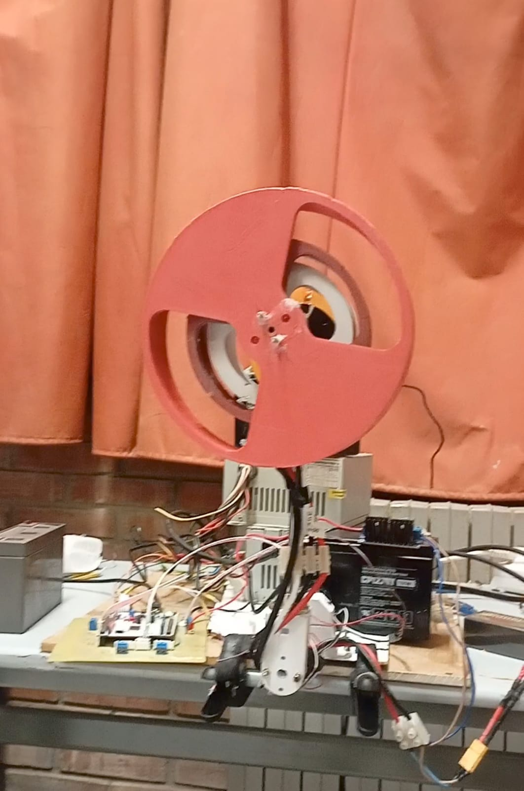

#  Inertia Wheel Pendulum — Nonlinear Control System

> A full-stack embedded control project: mechanical design, custom PCB, embedded firmware, and nonlinear control — from swing-up to stabilization.

<p align="center">
  
</p>

---

##  Overview

This project implements a **nonlinear control system** for an **Inertia Wheel Pendulum (IWP)** — a classic benchmark in control theory. The goal is to:

1. **Swing up** the pendulum from its natural downward rest position to the unstable upright equilibrium using an energy-based control strategy.
2. **Stabilize** it at the inverted position despite the system's inherent nonlinearities.

The entire system was designed and built from scratch: mechanical structure (SolidWorks + 3D printing), custom PCB (KiCad + STM32), embedded firmware, and monitoring via LabVIEW — all validated on real hardware.

---

## Team

| Name |
|---|
| **Aymen Turki** | 
| **Ahmed Amine Sebti** | 
| **Adem Daly** | 

> Academic project — Nonlinear Control Systems course

---

## Control Strategy

### Phase 1 — Swing-Up
An **energy-based controller** pumps energy into the pendulum until it approaches the upright position. The control law continuously compares the system's current mechanical energy to the target energy at the upright equilibrium and applies torque accordingly.

### Phase 2 — Stabilization
Once the pendulum is near the top (within a switching threshold), the controller switches to a **linearized stabilizing law** (e.g., LQR / state feedback) designed around the unstable equilibrium point. The nonlinear nature of the system requires careful tuning to ensure robustness.

### Switching Logic
A state machine handles the transition between the two phases based on the pendulum angle and angular velocity, preventing chattering at the switching boundary.

---

##  System Architecture

```
┌──────────────┐          PWM     ┌──────────────┐      A /B/C     ┌─────────────┐
│   STM32 MCU  │ ───────────────► │  SPARK MAX   │ ───── ────────► │  NEO Motor  │
│  (Control)   │                  │  Controller  │                 │  + Wheel    │
└──────┬───────┘                  └──────────────┘                 └──────┬──────┘
       │  Encoder / IMU feedback                                           │
       └───────────────────────────────────────────────────────────────────┘
             │
             ▼
       ┌───────────┐
       │  LabVIEW  │  (Real-time monitoring & data logging)
       └───────────┘
```

---

##  Software Stack

| Layer | Tool / Framework |
|---|---|
| Mechanical CAD | SolidWorks |
| PCB Design | KiCad |
| Embedded Firmware | STM32 HAL (C) |
| Control Monitoring | LabVIEW |
| Motor Configuration | REV Hardware Client |

---


---

##  Demo


[ Watch the video](./inercia%20wheel%20pendulum.mp4) 

---


##  Results

- Successful swing-up from rest position
- Stable inverted balance achieved

---

##  Key Learnings

- Nonlinear systems behave very differently from their linearized models once on real hardware
- The SPARK MAX's CAN interface introduces latency that must be accounted for in the control loop
- Mechanical friction and encoder noise are the main sources of disturbance in practice
- Switching between swing-up and stabilization requires careful hysteresis to avoid oscillation

---

